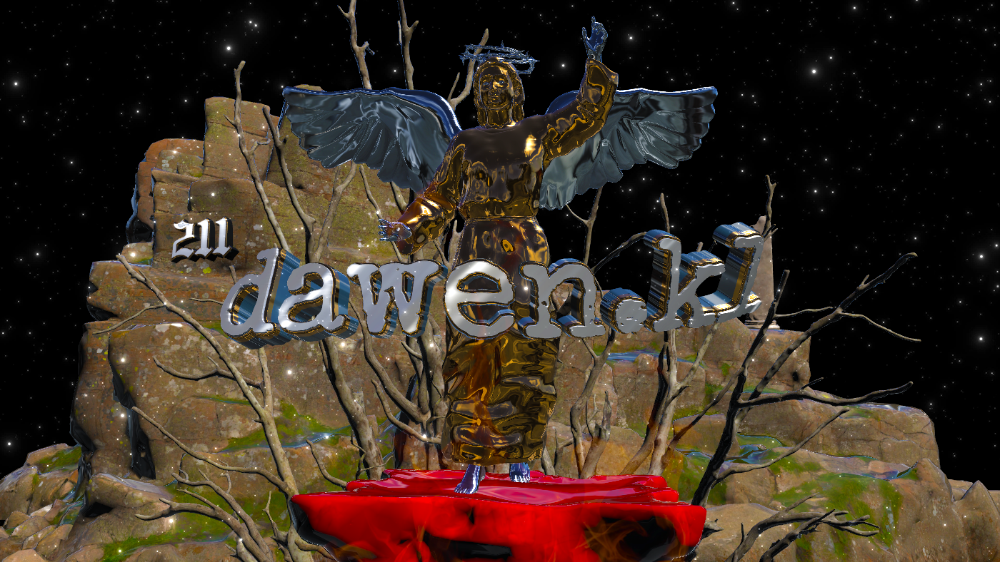

<h1 align="center">Hi 👋, I'm Dwen.Aozi</h1>
<h3 align="center">I'm Darwin Gacer, Currently Studying at Laguna State Polytechnic University taking Bachelor of Science In Computer Science</h3>

  

- 🌱 I’m currently learning **C# Languages**

- 👨‍💻 Visit my portfolio: [https://dawinfo.github.io/myth/](https://dawinfo.github.io/myth/)

- 📩 Direct Message me: [https://dawinfo.github.io/contact/](https://dawinfo.github.io/contact/)

- 📫 or Email me in: **gacerdarwin265@gmail.com**

- ⚡ Call me as **Dawen**

- 👾 Editing Video and Picture [https://www.tiktok.com/@dawenxt](https://www.tiktok.com/@dawenxt)

<h3 align="left">Connect with me:</h3>

<h3 align="left">Languages and Tools:</h3>

         

&nbsp;

